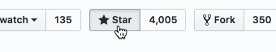

VtWsClient
============
A [Vtiger](https://www.vtiger.com/) [Web Services API](https://wiki.vtiger.com/index.php/Webservices_tutorials) Client Library for the Laravel framework.

Requirements
============

To be able to use this package you need to meet the following minimum requirements:
1. Laravel framework >= v9
2. PHP >= v8


## ★★★ Support this project ★★★

You can support us in a small way, please consider starring and sharing this repo! It helps us to get known and grow the community.



## Installing via Composer

The recommended way to install **`vtwsclient`** is through [Composer](https://getcomposer.org/download/).

    composer require "laranail/crm-tools-vtiger-client:*"

..or edit your composer.json file manually by appending *laranail/crm-tools-vtiger-client*:

    "require": {
        ...
        "laranail/crm-tools-vtiger-client": "*"
    }

## How to use

First let's setup some `.env` variables for later use.

```dotenv
## add these config options in your .env file
VTWSCLIENT_BASE_URI="your vtiger instance url"
VTWSCLIENT_PERSIST_CONNECTION=true
VTWSCLIENT_REQUEST_TIMEOUT=60
VTWSCLIENT_MAXIMUM_RETRIES=10
VTWSCLIENT_CACHE_TTL=21600
VTWSCLIENT_USERNAME="your API username"
VTWSCLIENT_ACCESS_KEY="your API access key"
VTWSCLIENT_PASSWORD="your API access password"
VTWSCLIENT_GUZZLE_HTTP_ERRORS=true
VTWSCLIENT_GUZZLE_VERIFY=false
VTWSCLIENT_THROW_ERRORS=true
VTWSCLIENT_LOGIN_WITH_ACCESS_KEY=true
```

Once you have setup the above configuration options and replaced the placeholders with your actual 
values, instantiate the class as illustrated below, and or refer to some [examples here](docs/index.md)

```php
<?php

use Simtabi\Laranail\CrmTools\VtigerClient;

// Instantiate the class 
$client = new VtWsClient();
```

Here you can find more **[detailed examples](docs/index.md)** on how to use **`vtwsclient`**.

## Support
Use the issues sections for support, bugs or feature related requests.

## Contributions
Anyone is welcome to contribute to the development of this plugin. There are various ways to do so, please see [CONTRIBUTING](CONTRIBUTING.md).

## More useful resources
* [Vtiger Webservices Tutorials](https://wiki.vtiger.com/index.php/Webservices_tutorials)

## Security

If you discover any security related issues, please email opensource@simtabi.com instead of using the issue tracker.

## Credits

- [Vtiger Cloud RestApi SDK](https://extend.vtiger.com/sdk/restapi-php)
- [All Contributors](CONTRIBUTORS.md)

## License

The MIT License (MIT). Please see [License File](LICENSE) for more information.